# MiniFlix

넷플릭스의 핵심 기능을 간소화하여 구현한 웹 기반 스트리밍 서비스입니다.

## 시스템 설계 기획 문서

### 화면 흐름도
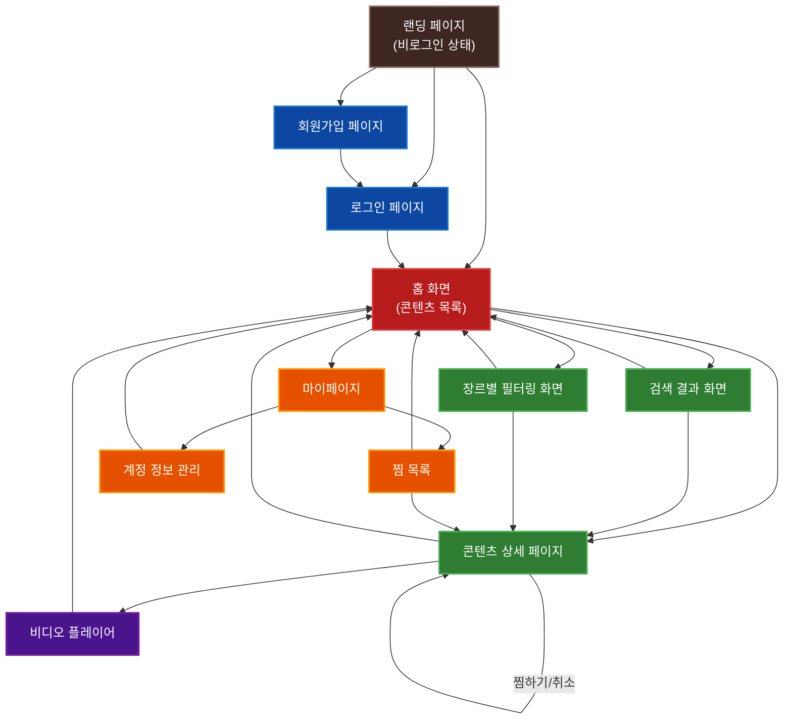

### ERD

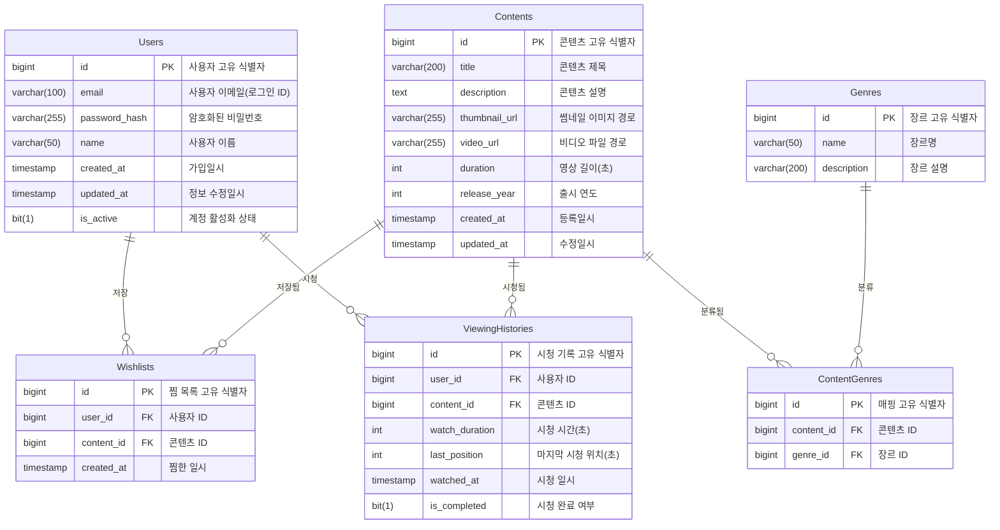

### 기능별 시나리오 시퀀스 다이어그램

#### 회원가입 시나리오

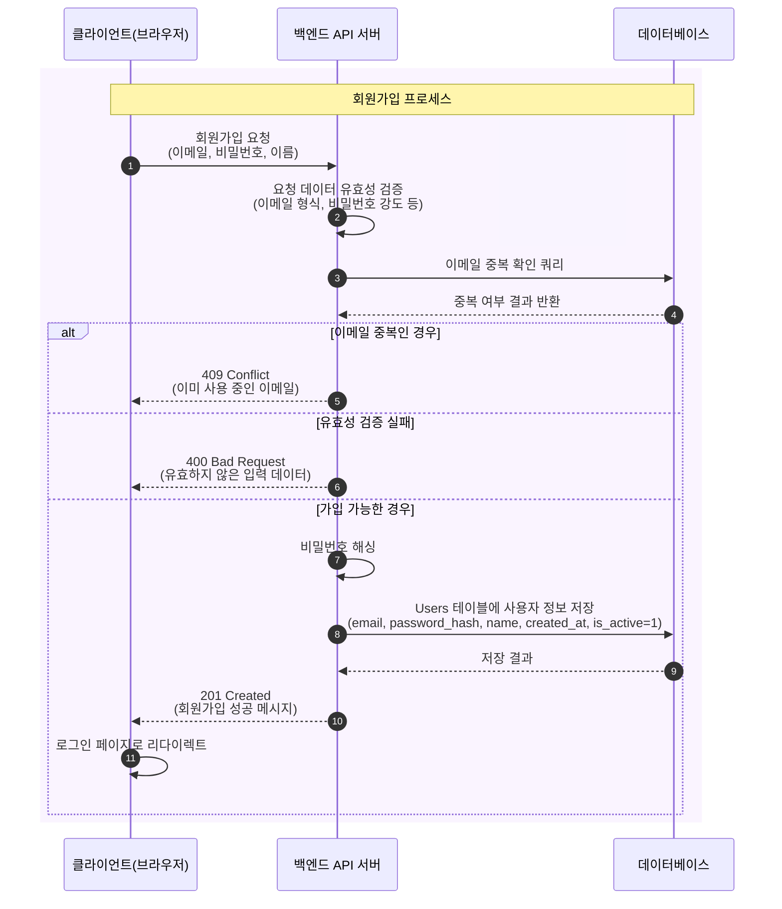

#### 로그인 시나리오

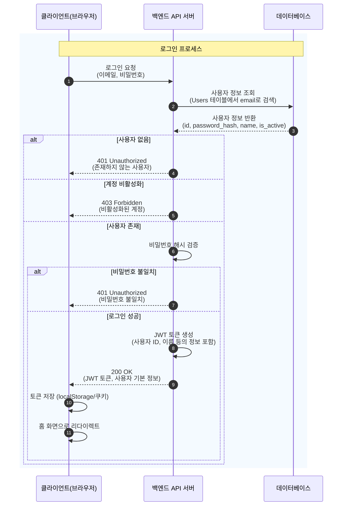


#### 홈 화면 콘텐츠 로드 시나리오

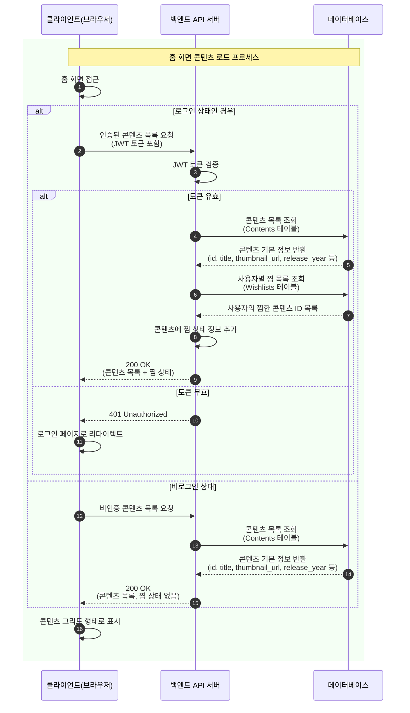


#### 콘텐츠 검색 시나리오

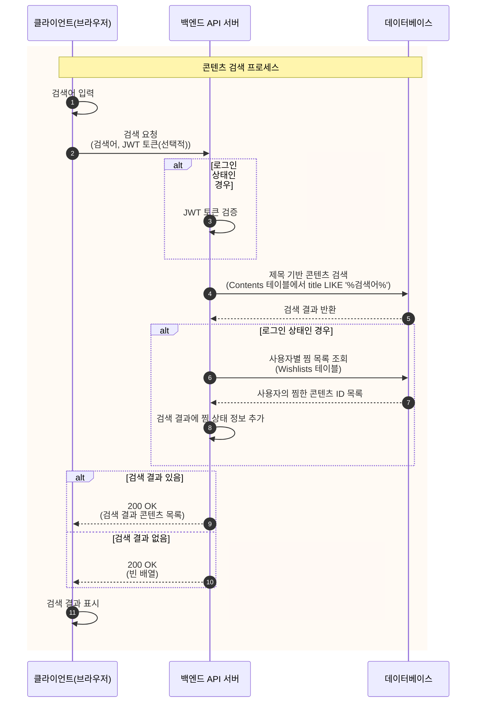


#### 장르별 필터링 시나리오

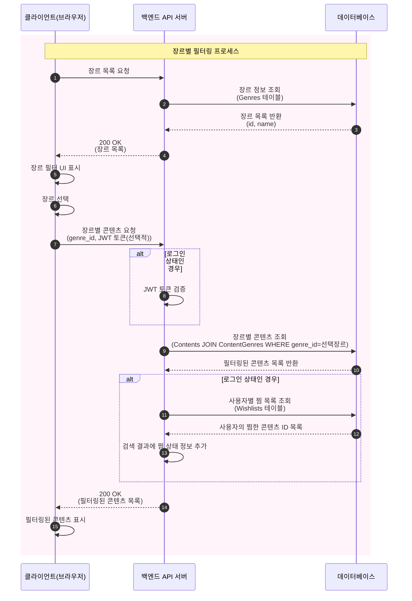


#### 콘텐츠 상세 정보 조회 시나리오

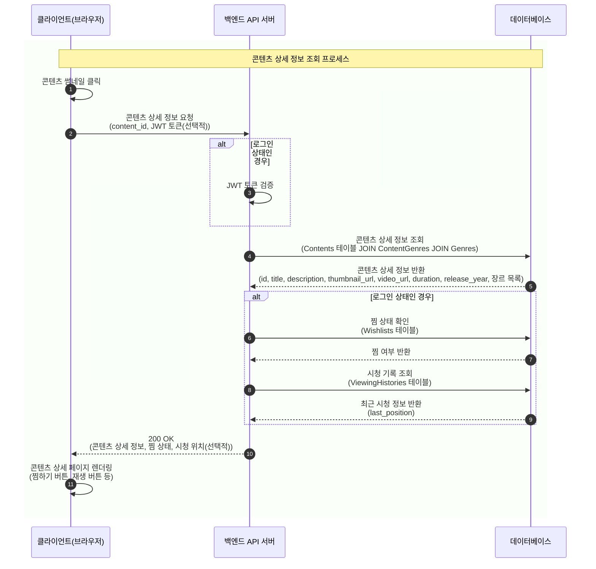


#### 콘텐츠 재생 시나리오

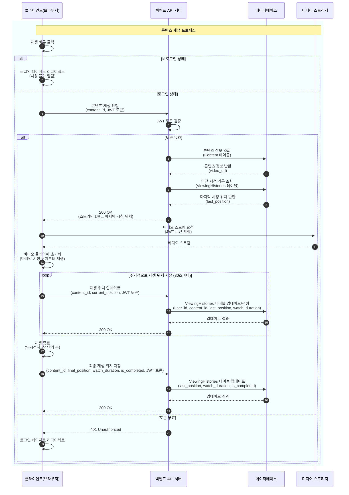


#### 콘텐츠 찜하기/취소 시나리오

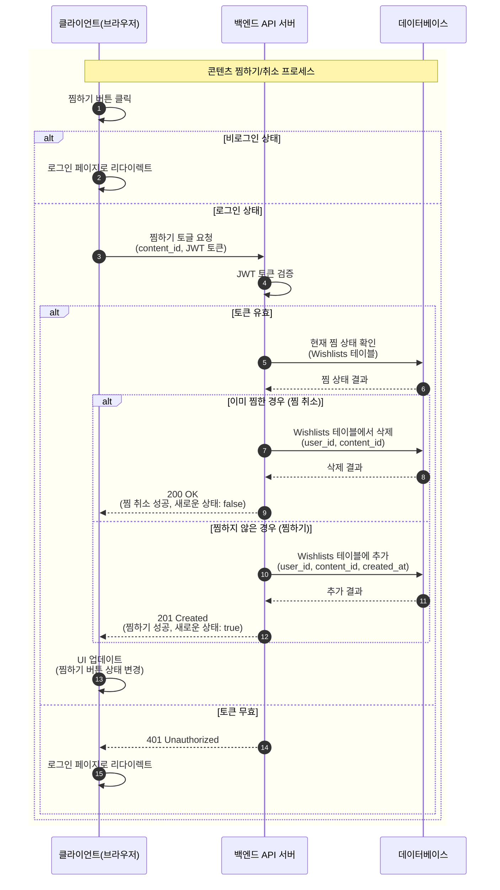


#### 찜 목록 조회 시나리오

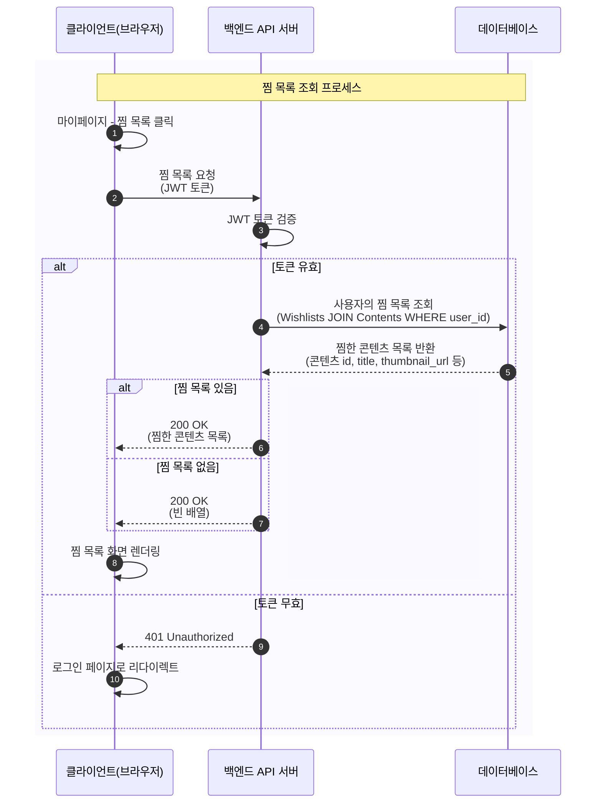


#### 계정 정보 조회 시나리오

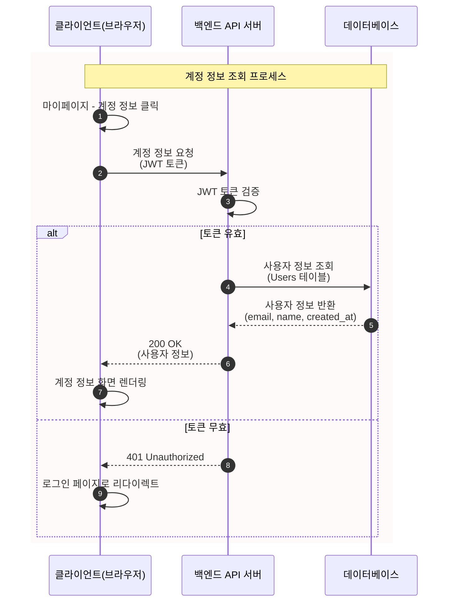


#### 계정 정보 수정 시나리오

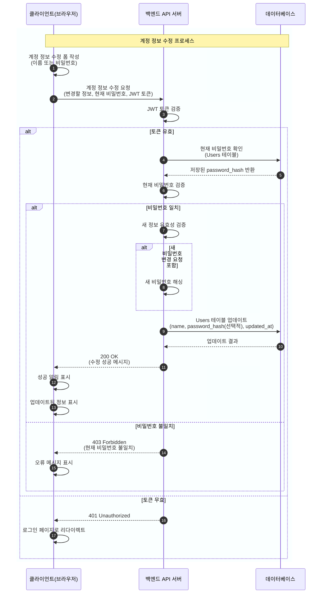

## 주요 기능

- 콘텐츠 스트리밍: 영화 및 드라마 클립을 웹에서 시청
- 콘텐츠 탐색: 홈 화면에서 콘텐츠 목록 확인, 검색 및 장르별 필터링
- 회원 기능: 회원가입, 로그인, 마이페이지
- 찜 목록: 관심 있는 콘텐츠 저장 및 관리
- 반응형 디자인: PC와 모바일에서 모두 사용 가능한 UI

## 기술 스택

### 프론트엔드
- TypeScript
- React
- Next.js
- Zustand (상태 관리)
- React Query (서버 상태 관리)
- TailwindCSS (스타일링)
- Axios (HTTP 클라이언트)

### 백엔드
- Golang
- Gin 프레임워크
- MySQL 데이터베이스
- JWT 인증
- Swagger API 문서

## 부가 설정

- [swag 바이너리 설치](https://github.com/swaggo/swag/releases/tag/v1.16.3)

## 실행 방법

### Docker Compose 실행

```bash
# 전체 서비스 실행
docker-compose up

# 백그라운드로 실행
docker-compose up -d

# 서비스 중지
docker-compose down
```

### 개발 환경 설정

```bash
# 프론트엔드 개발 서버 실행
cd frontend
yarn
yarn dev

# 백엔드 개발 서버 실행
cd backend
go mod tidy
./swag init && go run main.go    
```

## 접속 정보

- 프론트엔드: http://localhost:3000
- 백엔드 API: http://localhost:8080
- Swagger API 문서: http://localhost:8080/swagger/index.html
